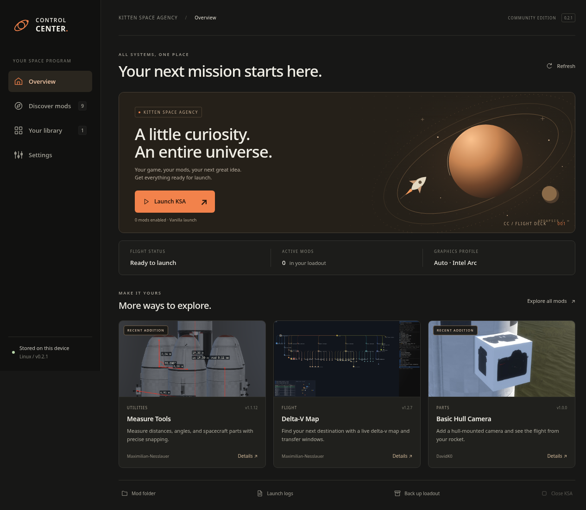
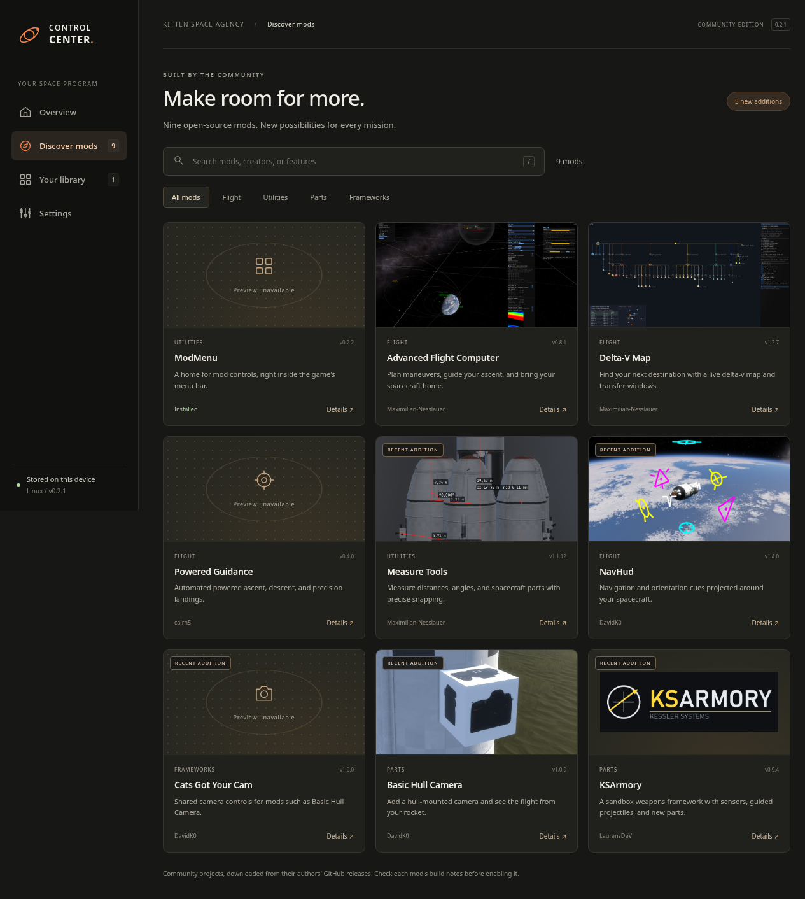
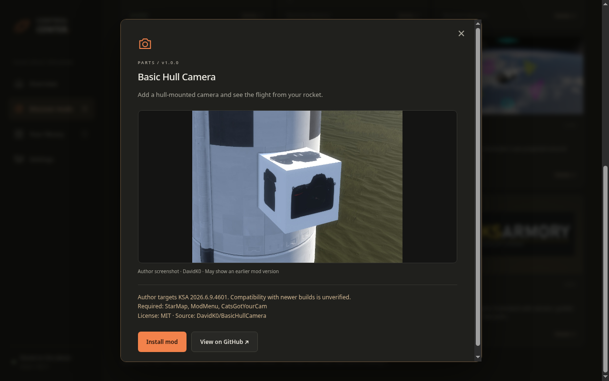

# KSA Control Center

[](LICENSE)


An independent desktop launcher and mod manager for **Kitten Space Agency** — built to make launching, modding, and keeping your space program safe feel simple.

**Launch KSA. Discover community mods. Protect your loadout.**

> [!CAUTION]
> **Only the Linux version has been tested on a real PC. The Windows version is an untested portable build.**

## See it in action

| Launch overview | Mod discovery |
| --- | --- |
|  |  |



## ★ What it can do

- Launches your installed KSA game, using StarMap when community mods are enabled.
- Includes nine curated open-source mod listings with pinned GitHub release downloads.
- Shows six author-published mod previews, available offline, with larger images and credits in Details.
- Shows versions, author compatibility notes, dependencies, and overlapping mods.
- Installs new mods disabled so you can review your loadout before launching.
- Searches mods by name, author, or feature, with category filters.
- Backs up mods and manifests. Updates stage files first and restore the previous folder if installation fails.
- **Intel Arc ready on Linux:** detects Intel graphics, uses the available Vulkan driver, and applies a stable FIFO presentation profile for Arc systems.
- Lets you select game, StarMap, and user-data folders.
- Keeps data on your computer; no account or telemetry.

This app is **not affiliated with RocketWerkz or Ahwoo**. KSA and StarMap are separate products and are not bundled. Community mods execute code inside the game; inclusion in the catalog is not a security audit or a promise of compatibility.

## Download disclaimer

**All community mods are downloaded and used at your own risk.** You are responsible for any damage, data loss, or security issues caused by third-party mods. Review the public source and compatibility notes before installing anything.

KSA Control Center does not bundle, re-host, or silently install community mods. When you choose to install a catalog entry, it downloads the author’s pinned GitHub release directly. See the ready-to-post [forum information page](docs/FORUM_POST.md) for the required release details.

## Run from source

Install Node.js 22 or newer. In this folder:

```sh
npm ci
npm start
```

This is an Electron app. Python, Tk, and a separately installed GTK Python runtime are not used.

1. Obtain KSA from [Ahwoo](https://ahwoo.com/app/100000/kitten-space-agency).
2. In **Settings**, choose the folder containing `KSA` (Linux) or `KSA.exe` (Windows).
3. For code mods, install [StarMap](https://github.com/StarMapLoader/StarMap/releases) separately and select its folder.
4. Linux StarMap launches through `dotnet StarMap.dll`; install the .NET runtime required by that StarMap release (the locally tested release uses .NET 10).
5. Confirm the game user folder contains your `manifest.toml`. Documents may be relocated or managed by OneDrive; the folder picker handles custom locations.
6. Open **Discover mods**, read Details, install, then enable the mod in **Your library**.

Required mods must be installed and enabled before dependent mods can be enabled. The app lists these requirements; it does not silently install dependencies. Optional dependencies are noted in the catalog.

## Platform status

| Platform | Status |
| --- | --- |
| Linux | Desktop UI and file operations tested on Fedora. Linux AppImage build verified. |
| Windows | Launch paths and build workflow provided. Not tested on a Windows PC yet. |
| macOS | Not supported. |

Linux needs a graphical desktop and the usual Electron system libraries. AppImage launch may require FUSE; alternatively extract with `--appimage-extract` and run `squashfs-root/AppRun`. Do not disable Chromium's sandbox.

Electron's UI hardware acceleration is disabled for compatibility on the tested Arc/Wayland setup. This does not disable the game's GPU acceleration. Selecting AMD, NVIDIA, or System default leaves device selection to the system. The launcher does not install drivers or promise performance gains. Auto-detect selects the Intel profile when it detects an Intel graphics device on Linux; on Windows it defers to the system.

The existing KSA graphics settings are preserved. The previous experimental Python graphics editor is not included in this repository.

## Build

```sh
npm run check
npm test
npm run pack
npm run dist -- --publish never
```

Build on the target operating system. Linux produces an AppImage; Windows produces a portable executable. Outputs are under `dist/`. Windows builds are unsigned and may display SmartScreen warnings.

The included GitHub Actions workflows run checks and create Linux and Windows artifacts. Pushing a version tag such as `v0.2.1` publishes both files as a GitHub Release. The Windows portable executable is unsigned and may show SmartScreen warnings.

## Verification

```sh
npm run test:ui
```

UI checks launch real Electron against an isolated temporary home. They require a desktop session (or Xvfb on Linux), and never launch KSA or modify your real game data. Tests cover image decoding and fallback, search, filters, details, toggles, backups, settings, and the minimum window width.

`KSA_TEST_HOME` is reserved for this isolated test environment. Do not set it for normal use.

## Data & backups

Existing companion configuration is read from `~/.config/ksa-companion/config.json` on Linux or `%APPDATA%/KSA Companion/config.json` on Windows. The default KSA user directory is `Documents/My Games/Kitten Space Agency`; it is configurable in Settings.

Backups live in the selected game user folder under `companion-backups`. Whole-loadout ZIPs contain `mods/` and `manifest.toml`. To restore manually, close KSA, back up the current files, and copy the desired backed-up files into the game user folder.

Updates replace the mod folder with the author's release. Any previous mod-specific settings remain in that update's backup folder, not automatically merged into the new release.

## Catalog maintenance

See [CONTRIBUTING.md](CONTRIBUTING.md). Metadata was checked on **2026-09-26**. Downloads are pinned, not automatically updated to newer releases. Five new listings are MeasureTools, NavHud, CatsGotYourCam, BasicHullCamera, and KSArmory. Older game targets are explicitly noted.

Catalog mods are not redistributed with this app. See [THIRD_PARTY.md](THIRD_PARTY.md) for source links and artwork attribution.

## Put this on GitHub

Use the supplied source ZIP or this source folder. It includes no game binaries, saves, personal settings, logs, or installed mods. To publish the included release files, create a repository, push the `main` branch, then push the `v0.2.1` tag; GitHub Actions builds and attaches Linux and Windows files automatically.

1. Create an empty repository on GitHub.
2. Upload the contents of the extracted source folder, including `.github/` and `.gitignore`, or use Git.
3. With Git, initialize this folder, add the files, commit, add your repository as `origin`, and push the main branch.
4. Check the Actions build before sharing Windows binaries.

## License

KSA Control Center is released under the [MIT License](LICENSE). You may use, copy, modify, and share the original launcher code and artwork under its terms. Third-party packages, mod previews, and mods retain their own licenses and attribution; see [THIRD_PARTY.md](THIRD_PARTY.md).

## AI transparency

[](https://www.aihonestybadge.com/ai-generated-badge)

This project uses the **AI Generated** badge because OpenAI Codex / GPT-5 created most of the application code and documentation with human direction, review, and decisions from the project owner.

[AI Honesty Badge](https://www.aihonestybadge.com/ai-tools) is a voluntary transparency label, not a security audit or certification. Its labels mean:

- **No AI:** People made the work without generative AI in its words, images, or code.
- **AI Assisted:** A person led the work and AI helped along the way.
- **AI Generated:** AI made most of the work, with a person directing and reviewing it.

For this project, AI helped plan and implement the launcher, write documentation, and create tests. The project owner chose the features, reviewed the results, selected the public mod sources, and controls all releases.
